# Album — Generated Sheets

用 `gc-minimal-zine-poster-v0-1` 技能（Standard Mode）生成的海报归档。
所有图为 3:5 竖版，1200×2150，模型 `nano-banana-pro`。

目前收录 **45 张**：`01–27` 为单张（singles），`28–45` 为 **Seasons 四季**影集（4 张封面 + 14 张内页）。

**在浏览器里翻这本图册** → 在仓库根目录运行 `python3 -m http.server 8080`，然后打开 <http://localhost:8080/album/>

完整元数据（含每张的最终 prompt）见 [`index.json`](index.json)。

---

## Contact sheet

| | | | | |
|:--:|:--:|:--:|:--:|:--:|
| 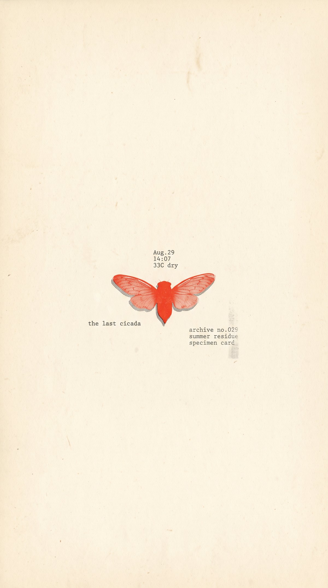 | 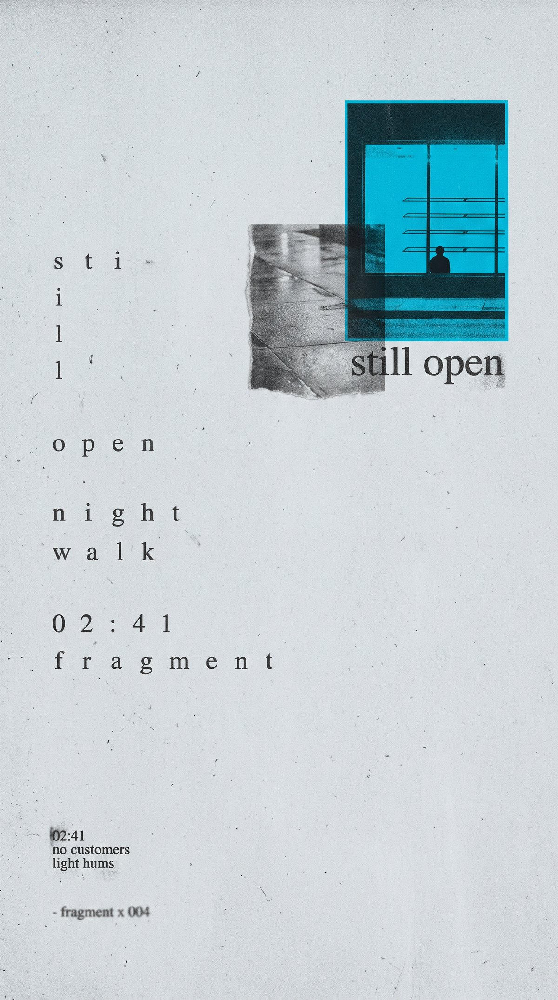 | 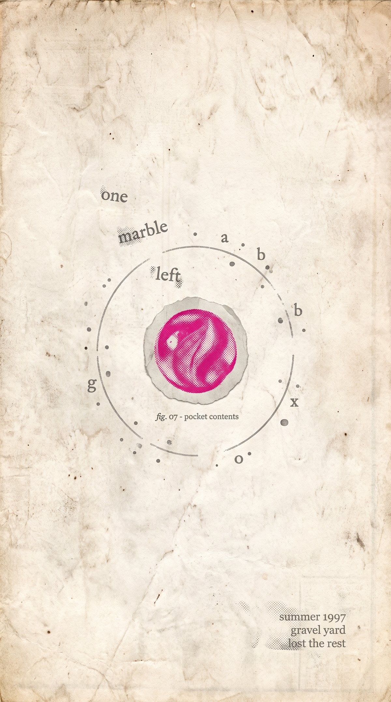 |  | 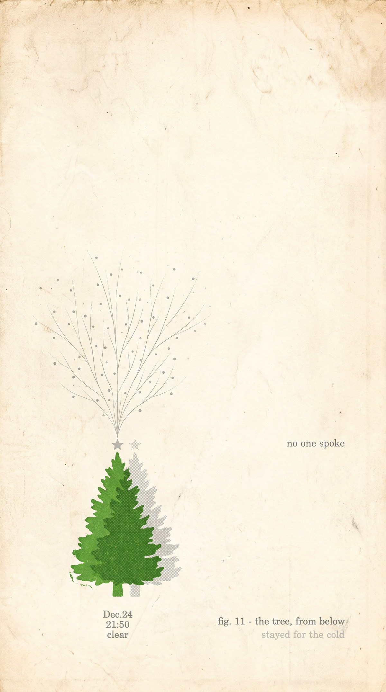 |
| `01` the last cicada | `02` still open | `03` one marble left | `04` someone wired the sky | `05` no one spoke |
| 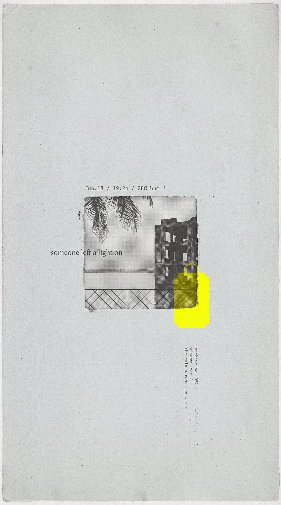 | 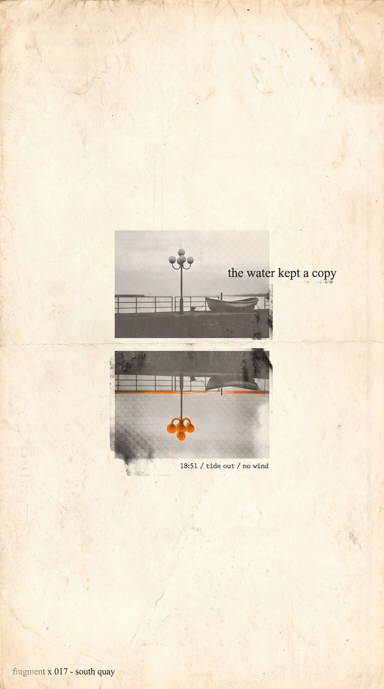 | 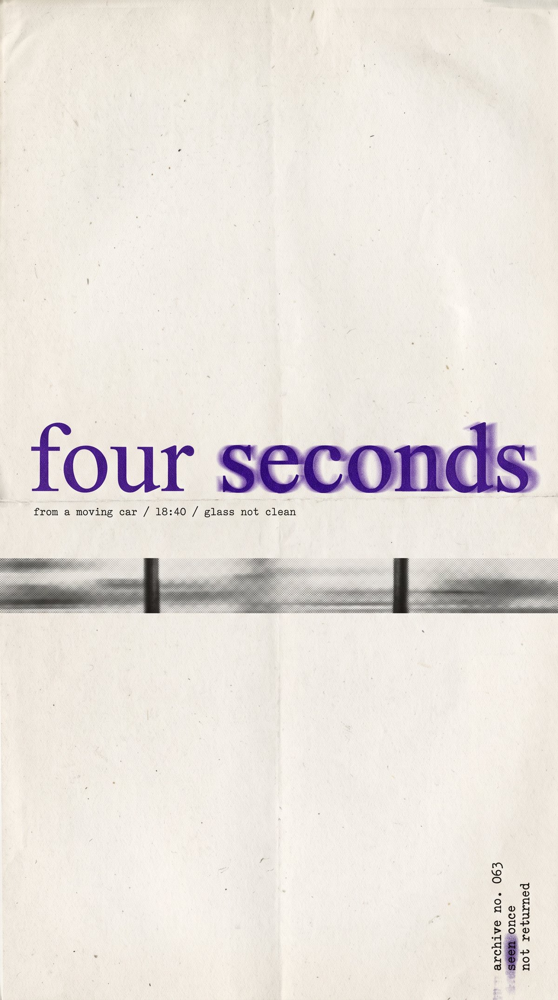 |  | 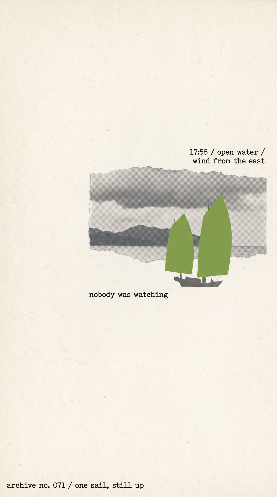 |
| `06` someone left a light on | `07` the water kept a copy | `08` four seconds | `09` the edge of the day | `10` nobody was watching |
| 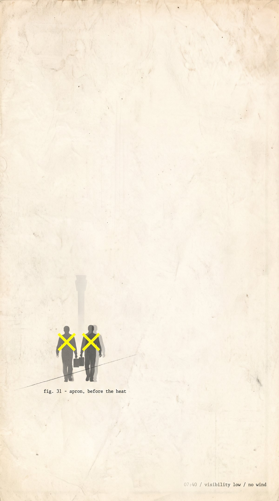 | 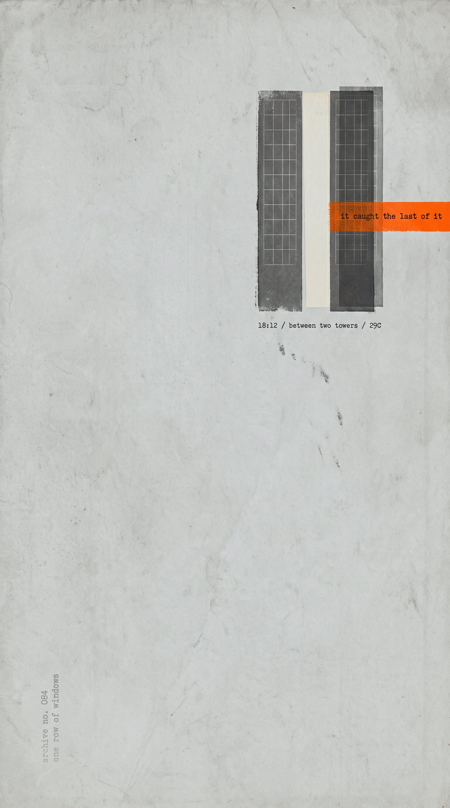 | 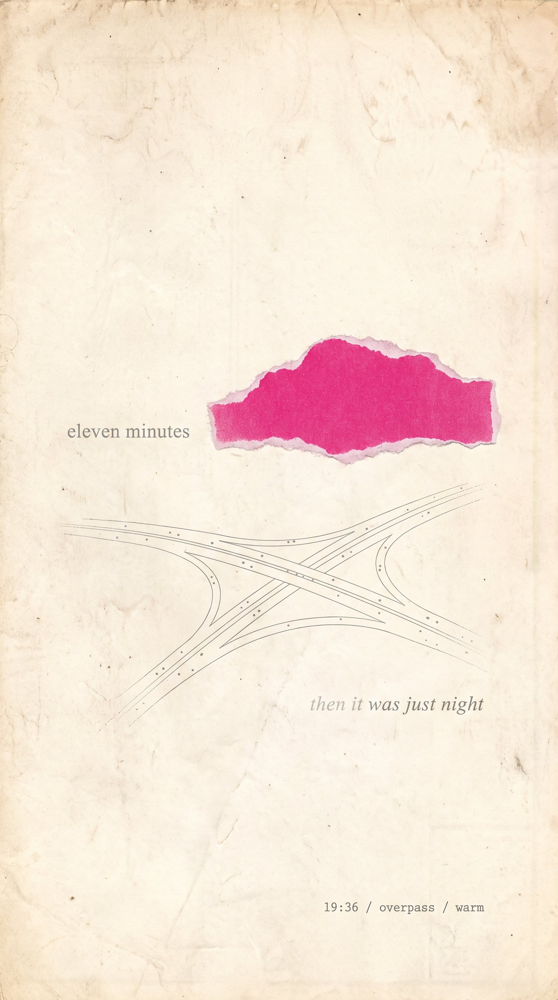 |  | 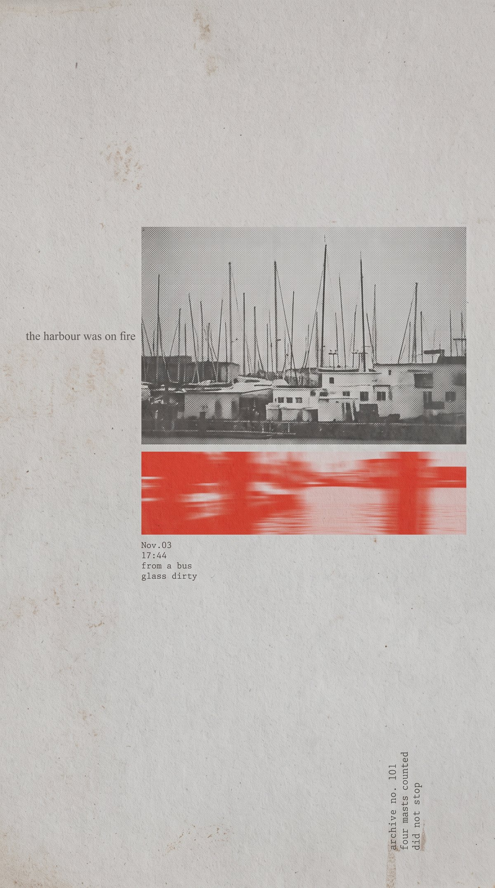 |
| `11` apron, before the heat | `12` it caught the last of it | `13` eleven minutes | `14` 跳进染缸 | `15` the harbour was on fire |
| 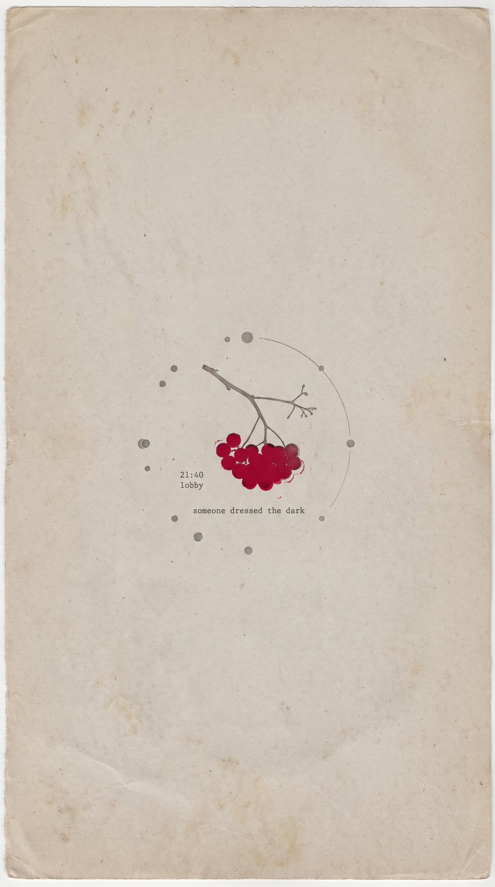 |  | 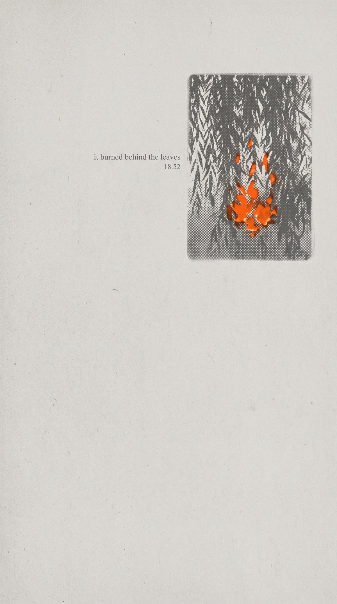 | 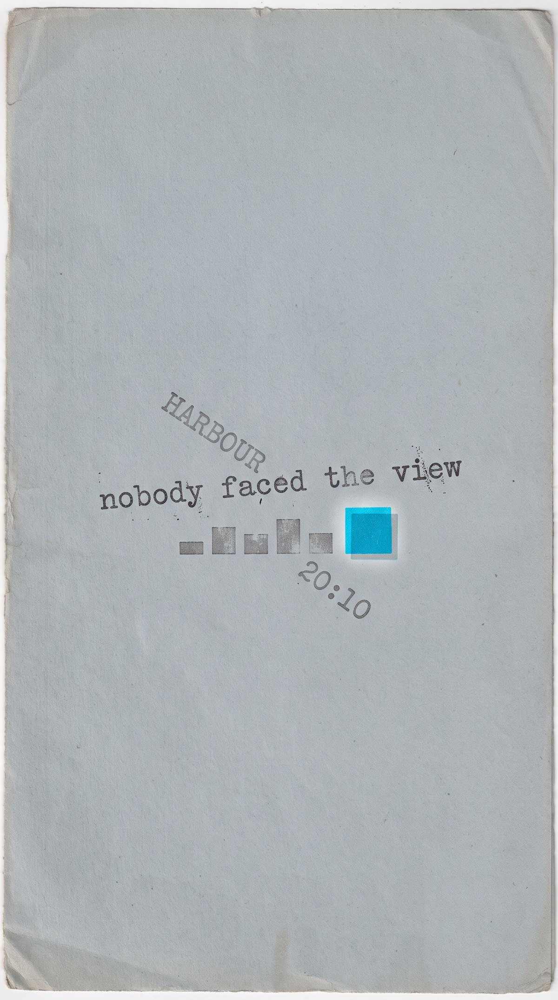 |  |
| `16` someone dressed the dark | `17` there is another world | `18` it burned behind the leaves | `19` nobody faced the view | `20` 有人跳海 |
|  |  |  | 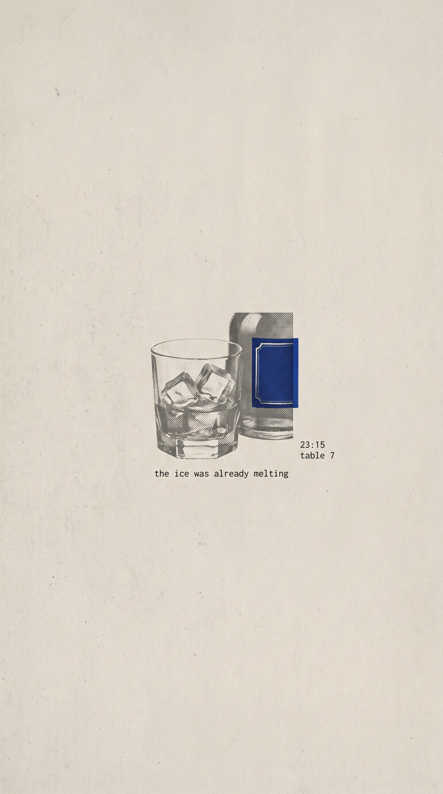 |  |
| `21` the cloud ate the fire | `22` we stood under the sign | `23` someone put a hat on the lion | `24` the ice was already melting | `25` one cloud stayed |
|  | 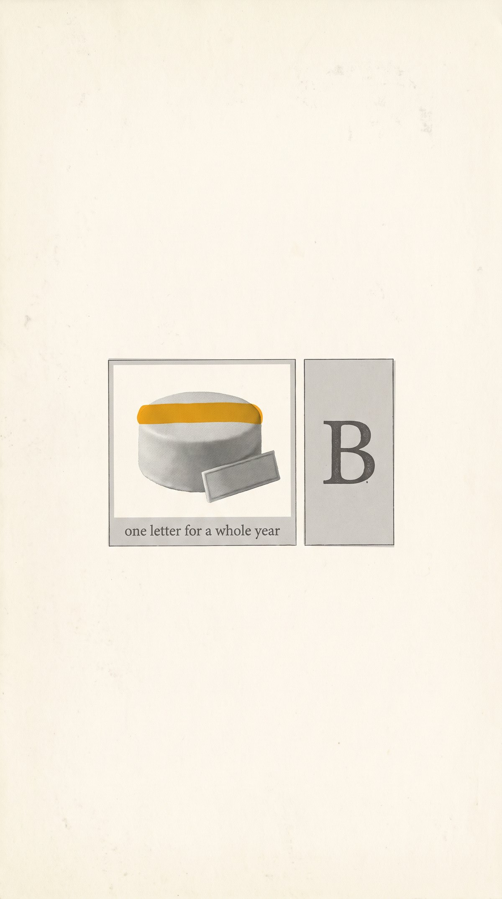 | | | |
| `26` the day drained into the pool | `27` one letter for a whole year | | | |

---

## Series — Seasons（四季）

一册四章，十八张。每章一张封面，后面跟它的内页。
在图册里按顺序翻这一册 → [`/album/?series=seasons`](../album/?series=seasons)

### 封面 `28–31`

同一棵树，一年拍四次。

| | | | |
|:--:|:--:|:--:|:--:|
|  |  |  |  |
| `28` SPRING 春 | `29` SUMMER 夏 | `30` AUTUMN 秋 | `31` WINTER 冬 |

### 内页 `32–45`

十四张用户照片，按 skill 的 Variation Engine 重做——封面是锁死的套版，内页则是一张一套配方，五个轴都不重复。

**春**

| | | | |
|:--:|:--:|:--:|:--:|
|  |  |  |  |
| `32` it happened without us | `33` the tree turned into weather | `34` almost nothing, for a week | `35` the field kept the small ones |

**夏**

| | | | |
|:--:|:--:|:--:|:--:|
|  |  |  |  |
| `36` the water never stopped to look | `37` still going, nobody near | `38` one tree stayed green longer | `39` THE SKY PRESSED DOWN |

**秋**

| | | |
|:--:|:--:|:--:|
|  |  |  |
| `40` it was already leaving | `41` the colour started to rust | `42` too much of it at once |

**冬**

| | | |
|:--:|:--:|:--:|
|  |  |  |
| `43` the fog took the garden | `44` it looked like frost | `45` someone stood very still |

> 十四张原片全是春夏拍的，没有一张真的秋冬。
> 秋章和冬章是**诗意读法**，不是实景：蒲公英絮读成“正在离开”，雾里的喷泉读成“被雾吃掉的花园”。
> 这是个可改的字段（`index.json` 里的 `season`），不是图本身的属性。

### 纸张怎么做到十八张一致

两层保险：

1. **提示词层**——十四段 prompt 的纸张描述和避坑句**逐字相同**，并明写禁止 tea-coloured wash / cream-to-white gradient。
   实测出图后十四张的纸白点已经收在 254/247/229 ± 2——彼此一致了，但比封面白一档。
2. **后期层**——[`tools/paper_normalize.py`](../tools/paper_normalize.py) 把每张的**墨重印到封面同一张纸上**：
   先估出这张自己的纸白点 `Pw`（亮度 85 分位以上像素的通道中位数），
   除出纯墨度 `poster / Pw`（空白处 = 1.0，实墨处 → 0），再乘回 `assets/seasons/paper.jpeg`，
   最后过一道与 `seasons_compose.py` 完全相同的纸纹。这是个逐通道比值，不是色偏，所以墨色和饱和度都保留。

结果：

| | 纸白点 (R/G/B) |
|---|---|
| 封面 `28–31` | 230 / 222 / 204（四张完全相同） |
| 内页 `32–45` | 229 / 221 / 203（十四张极差 ≤ 1） |

重跑：`python3 tools/paper_normalize.py <原图...> --outdir <目录>`

### 题注版 `plates/` — 把标题和介绍印在纸上

`img/` 里是海报本身。`plates/` 里是同样十八张的**题注版**：标题、中文标题、介绍
直接印在纸上，这样一套图递给别人，不需要旁边有这个仓库或这个图册。
成品 **1406 × 2881**，十八张同开本。

生成：`python3 tools/caption_plates.py`（可加 `--id 32` 只做一张）

**为什么是装裱，而不是直接压在画面上。** 每张海报底部 15% 几乎是空纸
（实测墨占比 ≤ 0.016，只有 44 号 0.059），看起来能排字。但两个理由否掉了它：

1. 那些负空间是过了 Quality Gate 的构图的一部分。事后压字等于改画。
2. 每张都带 skill 要求的印刷暗角 —— 边缘行均值 197 对中部 211。把题注直接
   接在图版下沿，那 13 级的落差会读成拼接失误。

所以图版**原尺寸**（1200 宽，不缩放）贴在更大的一张纸上，四边留 103px 纸边。
暗角于是变成它本来的身份：图版自己的边缘。

纸边和题注区用的是 `assets/seasons/paper.jpeg`，增益基准取**题注区**——
那是最大的一片连续空纸。纸边比它略暗，因为 `paper.jpeg` 自带扫描暗角，
真实的纸边就该略暗。

| | 纸白点 (R/G/B) |
|---|---|
| 图版内部 | 229 / 221 / 203 |
| 题注区 | 228–229 / 220–221 / 202–203 |
| 四周纸边 | 225 / 213 / 194（`paper.jpeg` 自身暗角） |

**中文排版做了这些事**，都是机器排版容易露怯的地方：

- **按字面定位**，不按 `font.size`。PIL 从 ascender 开始画，而中文字面顶比
  ascender 低一截；不修正的话版式表里写的间距根本不是看到的间距。
- **标点挤压** 0.26em。全角「，。」右侧自带约半个字的空，留着就是那种
  松垮的机器味。折行宽度用的是同一套 advance，否则行长会算错。
- **避头尾**：`，。、；：？！）」』】` 不许出现在行首，会被拉回上一行；
  `（「『【` 不许留在行末。
- **拉丁词不拆**：`88%` 这类连续 ASCII 当一个断行单位。
- **统一开本**：band 高度取最长那条介绍所需，短的把余量留给下边距。
- **页脚钉底**：`SPRING · 春` 和编号距底固定，不跟着介绍长度浮动 ——
  十八张的页脚实测落在同一行（底部 y = 93，18/18 一致）。

页脚用的是同一套中文宋体而不是拉丁字体，否则「春」会直接不渲染 ——
第一版就是这么错的。

字体覆盖是**程序检查**的，不是肉眼：用 fontTools 读 cmap，把十八张用到的
每个字符逐个查过，缺字 0。

### A4 打印版

`tools/seasons_pdf.py` 把 18 张题注版拼成一本 A4 PDF（19 页，含一张标题页）。
图版按原生 300 dpi 摆放：1406×2881 px = 119.0 × 243.9 mm，居中于 A4，
左右留边 45.5 mm、上下 26.5 mm；图版之外的页面不印任何底色，因为图版自己已经带着纸面。
内嵌 JPEG 是逐字节原样写入的（md5 核对过），不重采样、不二次编码。

标题页没有用 reportlab 排版——Noto Serif CJK 是 CFF/PostScript 轮廓，reportlab 拒绝嵌入
（`TTFError: postscript outlines are not supported`）。改为用 PIL 复用 `caption_plates` 的
纸面、字距与字体助手来画，于是标题页是这本书里的一张纸，而不是外挂的封面。

```bash
python3 tools/seasons_pdf.py
```

### 打包一整本

```bash
python3 tools/seasons_pack.py                 # -> dist/seasons-album-plates.zip
python3 tools/seasons_pack.py --edition img   # 无字版
```

题注版的意义就是一套文件能自己走，所以包也按能直接看来做：

- 文件名前缀是**阅读顺序**（每季封面，然后该季内页），因为文件浏览器唯一
  保证的排序是字母序；归档编号也留在名字里，方便回查 `index.json`。
- 附一份 `目录 CONTENTS.txt`，把标题和介绍以文本形式带上，引用不必从图上抄。
- 文件名保持 ASCII —— ZIP 里的中文名在某些 Windows 解压工具上仍会乱码，
  而文件名也不是放诗的地方。
- JPEG 用 store 不用 deflate（压不动），只有目录文本压缩。

`dist/` 不进版本库：包里每个字节都已经在仓库里了，提交它等于把图片存两遍，
而这个脚本随时能重建。

### 为什么封面是合成的，不是直接生成的

第一版四张是整页直接生成的，单看每张都不错，摆在一起就散了：
图版横向位置在左／中／右之间漂，宽度 60.7%–67.4%，顶边 11.2%–23.0%，
其中一张还自作主张把纸换成了毛边纸浮在另一张纸上，色块面积从 1.09% 到 2.36% 差了一倍多。

文生图对**版式**没有可复现性——同一段提示词跑四次就是四个版面。再重生也只是换一组随机偏移。

所以改成：**模型只画方形照片，页面由代码排。**

- 照片：`assets/seasons/plate-*.jpeg`，先生成春，再以春为参照图生成夏／秋／冬，锁死同一棵树、同一机位、同一地平线
- 纸：`assets/seasons/paper.jpeg`，一张，四张海报共用
- 版面：[`tools/seasons_compose.py`](../tools/seasons_compose.py)，一张几何表驱动全部四张

结果四张除了照片内容和那一枚色块之外**逐像素相同**：

| 一致项 | 实测 |
|---|---|
| 图版包围盒 | 四张同为 x 22.6–77.7%、y 20.3–66.8% |
| 色块面积 | 四张同为画布的 **1.612%**（规范区间 0.8–2.5%） |
| 底稿颜色 | 亮度重映射到同一条暖灰褐 ramp，`#F0E9DA → #483E32` |
| 留白 | 81.6% / 82.8% / 83.2% / 84.4% |
| 文字 | 三行固定结构，仅季节词与索引号变化 |

重跑这套图：`python3 tools/seasons_compose.py`

内页则相反——它们不需要版式一致，需要的是纸一致。所以版式交回给模型和 Variation Engine，
纸交给代码（[`tools/seasons_pages.py`](../tools/seasons_pages.py) 写 prompt，`paper_normalize.py` 统一纸）。

---

## Series — Colorful Journey（旅程留色）

六张，`46–51`，一张旅行照片一张纸。相对 skill 默认值有两处**刻意的、按用户要求做的偏离**，
不打算把它们说成"合规"：

| 偏离 | skill 默认 | 本系列 | 实测 |
|---|---|---|---|
| 纸底 | 暖白/象牙（Seasons 实测 229/221/203） | 近白棉纸 | 六张 250–253，R−B 4–6 |
| 彩色面积 | 占版面 0.8–2.5%，或视觉团块的 15–35% | 放宽到 3–6% | 1.37%–7.88%，四张高于上限 |

色块本身仍然守规矩：单一色相、满饱和、不透明，六张各用一个色，缩到 64px 宽仍然一眼可见。

| id | 地点 | 色 | hex | 版式 / 图像锚 / 字 / 肌理 / 情绪 | canvas | cluster | 64px |
|---|---|---|---|---|---|---|---|
| 46 | Paris | 洋红 | `#E8357F` | irregular-cutout · 撕纸剪贴 · 字压图边 · risograph · night | 5.43% | 35.2% | 392 |
| 47 | Paris | 钴蓝 | `#1D4FA8` | dual-panel · 旧印刷插图 · 档案微字 · halftone · memory | 5.65% | 41.5% | 375 |
| 48 | Barcelona | 琥珀橙 | `#F07A14` | single-specimen · 抽象纹理窗 · 竖排单列 · 凸版洇墨 · solitude | 2.29% | 42.8% | 216 |
| 49 | London | 番茄红 | `#E0342A` | dot-orbit · 平面剪影 · 打字机微字 · xerox · afternoon | 1.37% | 90.1% | 102 |
| 50 | Cappadocia | 紫罗兰 | `#7A46C6` | upper-right-block · 实色块 · 斜排散字 · risograph · surreal | 7.88% | 75.6% | 583 |
| 51 | Erciyes | 青 | `#1FA5D6` | lower-left-float · 小褪色照片 · 低反差灰字 · scan noise · quiet | 4.88% | 30.9% | 356 |

生成用 `tools/journey_pages.py`，入索引用 `tools/journey_index.py`。
和 Seasons 不同，这六张**没有**过 `paper_normalize.py`，是各自出白后实测的。

### 一个到今天才发现的 bug：文字白名单里的分隔符会被印出来

第一版白名单助手把字符串写成 `"a" / "b"`。模型如果把两条排进同一行，就会**连引号带斜杠一起印在纸上**：
46 出来是 `"everyone faced the window" / PARIS 19:48`，49 同样。47 侥幸把三条断成三行，所以干净——
Seasons 整本十四张都恰好断了行，这个毛病才一直没暴露。

修法是 `whitelist_v2`：不用任何分隔符，一条一行给出，并显式禁止引号、斜杠、括号、项目符号、破折号。
`whitelist_v1` 的原文保留在源码里没删，因为 47/50/51 是它产出的，`index.json` 必须存**真正出图的那条提示词**。
`tools/seasons_pages.py` 里的白名单仍是 v1 —— 已知隐患，但改了会让已发布的 14 张提示词与图对不上，故未动。

### 返工记录

- **46** 第一版：分隔符泄漏，且洋红只占 1.46%（黑色室内把窗吃掉了）。改成直接规定"粉色自身占版面 4%"，并要求剪贴上三分之二留空天。
- **48** 第一版：印出 `f o n y b i s` 一串散字母 —— 这是**我自己的提示词自相矛盾**：Variation Engine 要"碎裂漂浮字母"，白名单又只许出现那一句话。改成"竖排单列，每个字母都属于这句话"。
  第二版字和窗都对了，但纸色跑成奶黄（254/251/240，R−B 14，其余五张只有 4–6），违背你的第 1 条要求，于是**单独补了第三次**，只加硬纸色段落。三版提示词与出图一一对应，第三版原文以 `PROMPT_48_SHIPPED` 逐字存在源码里。
- **49** 第一版：红点只有 0.559%，低于 skill 下限。原因是我按"比鸟大一点"描述尺寸。改成按版面比例说——"约版面宽度的四分之一"。
- **47 / 50 / 51** 一次过，未返工。

## Series — Plates（整版照片）

六张，`52–57`，与 `46–51` **一一对应**：同一张照片、同一句话、同一个色相。
两组并排留着，是为了能比较两种处理。

### 为什么要另做一组

用户看完 `46–51` 的评价是"太简化了，本身的图片就很好看"。查下来这不是我提示词写坏了，是**结构性的**：
skill 的 `### Image Anchor` 是一张封闭词表，只有八项 ——
`tiny faded photo`、`torn-paper clipping`、`flat silhouette`、`solid color block`、
`old printed illustration`、`object specimen`、`translucent geometric overlay`、`abstract texture window`。
**八项全是减法。** 词表里没有一项的意思是"把这张照片好好印出来"。
所以 48 变成了一扇通用哥特窗而不是高迪的玻璃，49 扔掉了 Serpentine 的天际线只留六只灰鸭子。

`Mode Policy` 又写死了 "Use Standard Mode for all generation"，没有面向照片的模式可选。

### 立足点，和明确放弃的那条规则

两处 skill 自己的原文支持整版印照片：

- Color Engine：*"Color can carry the subject itself. Prefer a colored tree, fruit, shell, flower,
  geometric cutout, window, poster fragment, or **image panel** …"* —— `image panel` 就是图版。
- Negative Constraints 禁的是 *"**full-bleed** subject or scene"* —— 禁的是**出血**，不是**尺寸**。

**放弃的规则：** Color Engine 那条"主色占版面 0.8%–2.5%"。本组图版实测占版面 27.9%–41.4%。
这不是踩线擦边，是换了策略，如实记录，不当作合格上报。

保留下来仍在生效的：近白纸、平扫无透视、极简排字、印刷瑕疵（网点/riso 错版/扫描噪点）、单一主色、大面积留白。

### 实测

| id | 地点 | 色 | hex | 图版几何 / 印法 | 纸白 | R−B | 主色 canvas | 图版占版面 |
|---|---|---|---|---|---|---|---|---|
| 52 | Paris | 品红→橙 | `#E8357F` | 3:4 竖版，左上，宽 62% · 三色 riso | 253/252/249 | +4 | 3.88% | 31.0% |
| 53 | Paris | 钴蓝 | `#1D4FA8` | 5:4 横版，居中偏上，宽 72% · 满彩，连画框一起印 | 252/252/251 | +1 | 6.45% | 37.3% |
| 54 | Barcelona | 琥珀 | `#F07A14` | 窄竖条，居中，宽 40% · 满彩，主体是扶手上的光 | 252/251/248 | +4 | 7.89% | 41.3% |
| 55 | London | 番茄红 | `#E0342A` | 16:6 横带，宽 78% · 中性灰网点，只有浮标是彩色 | 249/249/247 | +2 | 0.01% | 39.3% |
| 56 | Cappadocia | 紫 | `#7A46C6` | 3:2 横版，上部，宽 80% · 满彩渐变天 | 253/253/250 | +3 | 8.93% | 27.9% |
| 57 | Erciyes | 青 | `#1FA5D6` | 4:5 竖版，下部居中，宽 70% · 严格双色，雪＝未印的纸 | 253/253/249 | +4 | 26.44% | 41.4% |

两个数字需要单独解释：

- **55 的 0.01%** 是设计意图，不是失败。整句话就是 "one red thing on the water"，
  红浮标按照片里的**真实大小**印（21×21 px），不放大。实测只有 356 个红像素。
  1200 宽的成品上仍然一眼能找到；缩到 64px 缩略图就看不见了 —— 这是这张接受的代价。
- **57 的 26.44%** 是因为双色版里青色**就是**油墨本身。
  实测 100% 的有彩像素落在 180°–210° 色相区间，是真双色，不是"带青天的彩照"。

### 质检

六张纸白全部中性（R−B ≤ +4，对照 48 第二版翻车时的 +14）。
文字逐字放大核对过，六张全部干净：无引号、无斜杠、无散落字母、无拼写错误。
`whitelist_v2` 继续有效。

生成用 `tools/plates_pages.py`，入索引用 `tools/plates_index.py`。
三个索引脚本（`seasons_index` / `journey_index` / `plates_index`）互相不覆盖，任意顺序运行结果一致。

## Variation recipes

每张都走了一套不同的 Variation Engine 配方，避免结构重复。

| # | Title | Layout | Image anchor | Typography | Accent | Texture | Mood |
|---|-------|--------|--------------|------------|--------|---------|------|
| 01 | the last cicada | single-specimen | object specimen | archive microtext | tomato-red | risograph grain | summer |
| 02 | still open | upper-right-block | color block + faded photo | fragmented letters | cyan | xerox softness | night |
| 03 | one marble left | dot-orbit | object specimen | diagonal + ghost text | magenta-pink | halftone degradation | childhood |
| 04 | someone wired the sky | irregular-cutout | torn-paper clipping | phrase against edge | ultramarine | risograph grain | night |
| 05 | no one spoke | lower-left-float | flat silhouette | drifting phrase | pear-green | letterpress bleed | solitude |
| 06 | someone left a light on | center-fragment | abstract texture window | archive microtext | lemon-yellow | xerox softness | quiet |
| 07 | the water kept a copy | dual-panel | mirrored faded photo | phrase against edge | orange | halftone degradation | seaside |
| 08 | four seconds | type-led | type as anchor | headline-as-object | violet | motion blur | memory |
| 09 | the edge of the day | single-specimen | object specimen | almost textless | tomato-red | letterpress bleed | solitude |
| 10 | nobody was watching | irregular-cutout | torn-paper clipping | fragmented letters | pear-green | film grain | slight surrealism |
| 11 | apron, before the heat | lower-left-float | flat silhouette | almost textless | lemon-yellow | aged mottling | solitude |
| 12 | it caught the last of it | upper-right-block | solid color block | text inside block | orange | letterpress bleed | night |
| 13 | eleven minutes | irregular-cutout | torn color cutout | gray ghost text | magenta-pink | risograph grain | slight surrealism |
| 14 | 跳进染缸 | single-specimen | ink blot specimen | headline-as-object | cobalt-blue | capillary wicking | night |
| 15 | the harbour was on fire | dual-panel | faded photo + smear | archive microtext | tomato-red | directional blur | memory |
| 16 | someone dressed the dark | dot-orbit | pressed berry specimen | archive microtext | crimson-red | letterpress bleed | night |
| 17 | there is another world | center-fragment | silhouette in torn patch | phrase against edge | turquoise | risograph grain | slight surrealism |
| 18 | it burned behind the leaves | upper-right-block | abstract texture window | gray ghost text | molten orange | halftone degradation | memory |
| 19 | nobody faced the view | type-led | solid color block | diagonal scattered words | cyan-blue | scan noise | night |
| 20 | 有人跳海 | dual-panel | torn-paper clipping | headline-as-object（手写中文） | acid yellow | xerox softness | seaside |
| 21 | the cloud ate the fire | lower-left-float | flat silhouette | archive microtext | chrome yellow | aged mottling | solitude |
| 22 | we stood under the sign | upper-right-block | old printed pictogram | almost textless | signal red | letterpress bleed + blur | slight surrealism |
| 23 | someone put a hat on the lion | single-specimen | film-photo cutout | fragmented letters | kelly green | film grain | childhood |
| 24 | the ice was already melting | center-fragment | object specimen pair | archive microtext | porcelain cobalt | halftone degradation | night |
| 25 | one cloud stayed | irregular-cutout | torn-paper clipping | almost textless | flamingo pink | risograph grain | solitude |
| 26 | the day drained into the pool | single-specimen | flat silhouette | phrase against edge | tangerine orange | aged mottling | seaside |
| 27 | one letter for a whole year | dual-panel | clipping + letter-as-object | text inside panel | mango gold | xerox softness | memory |
| 28 | seasons 01 — spring | single-specimen | landscape fragment | letterspaced serif + index | cherry pink | collotype + misregistration | spring |
| 29 | seasons 02 — summer | single-specimen | landscape fragment | letterspaced serif + index | grass green | collotype + misregistration | summer |
| 30 | seasons 03 — autumn | single-specimen | landscape fragment | letterspaced serif + index | vermilion | collotype + misregistration | autumn |
| 31 | seasons 04 — winter | single-specimen | landscape fragment | letterspaced serif + index | ice cyan | collotype + misregistration | winter |
| 32 | it happened without us | center-fragment | tiny faded photo | almost textless | magenta-pink | film grain | quiet |
| 33 | the tree turned into weather | irregular-cutout | torn-paper clipping | fragmented letters | cobalt-blue | risograph grain | childhood |
| 34 | almost nothing, for a week | lower-left-float | tiny faded photo | archive microtext | violet | xerox softness | afternoon |
| 35 | the field kept the small ones | dot-orbit | object specimen | diagonal scattered words | lemon-yellow | halftone degradation | slight surrealism |
| 36 | the water never stopped to look | upper-right-block | tiny faded photo | phrase against edge | cyan | scan noise | summer |
| 37 | still going, nobody near | single-specimen | object specimen | almost textless | tomato-red | letterpress bleed | afternoon |
| 38 | one tree stayed green longer | dual-panel | photo + solid color block | text inside block | pear-green | aged mottling | quiet |
| 39 | THE SKY PRESSED DOWN | type-led | flat silhouette | headline-as-object | ultramarine | risograph grain | slight surrealism |
| 40 | it was already leaving | single-specimen | object specimen | archive microtext | orange | film grain | solitude |
| 41 | the colour started to rust | dual-panel | torn-paper clipping | gray ghost text | cyan | halftone degradation | memory |
| 42 | too much of it at once | irregular-cutout | abstract texture window | fragmented letters | lemon-yellow | xerox softness | slight surrealism |
| 43 | the fog took the garden | center-fragment | tiny faded photo | phrase against edge | tomato-red | aged mottling | solitude |
| 44 | it looked like frost | lower-left-float | translucent geometric overlay | diagonal scattered words | cobalt-blue | letterpress bleed | memory |
| 45 | someone stood very still | single-specimen | flat silhouette | almost textless | orange | scan noise | solitude |

> `28–31` 共用同一套配方——封面要的是一致，不是变化，Variation Engine 在这里被刻意关掉。
> `32–45` 又把它打开：十四张的 layout / anchor / typography / texture / mood 五个轴都不重复，
> 相邻两张也不会用同一种。它们共享的只有纸。

---

## Sources

| # | 来源 |
|---|------|
| 01–03 | 主题词（无参考照片） |
| 04–05 | 圣诞树仰拍，灯串自顶端星星放射 |
| 06 | 室内窗框外的湖与废楼，一盏亮灯 |
| 07 | 码头日落，栏杆与球灯的完整水面倒影 |
| 08 | 行驶车窗外糊掉的水面夕照 |
| 09 | 堤岸夕照，两盏球灯与橙色地平线 |
| 10 | 灰云灰海之间一艘绿帆帆船 |
| 11 | 雾霾金光里的停机坪，两名地面人员走远 |
| 12 | 香港两栋高楼之间的一线夕照 |
| 13 | 粉紫晚霞下的立交桥车流 |
| 14 | livehouse 现场，墙上「跳进染缸」匾额 |
| 15 | 车窗外掠过的港口，天空烧成橙红 |
| 16 | 酒店门厅，白色长毛圆桌上一丛红果与礼盒，四周全黑 |
| 17 | 中环夜街，整面墙的靛蓝壁画与一匹小白马，「別有天地」 |
| 18 | 逆光垂柳帘幕，叶子后面透出燃烧的落日 |
| 19 | 维港边餐厅夜景，满座背对天际线，桌上一只发蓝光的冰桶 |
| 20 | 一叠冲浪摄影展海报，黄色手写「有人跳海 有人滑浪」 |
| 21 | 火红日落被一大团深色云压住，地平线只剩一条黄带 |
| 22 | 「NO SMOKING 嚴禁吸煙」牌子前，两只手各夹一支烟 |
| 23 | 夜里的金色狮子雕塑，头上戴着针织帽 |
| 24 | 黑色大理石桌上的威士忌、冰杯与铜锅火锅 |
| 25 | 粉紫与蓝的黄昏天空，右侧一大团深色云 |
| 26 | 椰子树剪影逆着落日，无边泳池与扶梯 |
| 27 | 生日蛋糕，芒果淋面、巧克力牌与糖片字母 B |
| 28–31 | Seasons 封面，无照片来源；图版为模型生成，版面为代码合成 |
| 32–45 | Seasons 内页，用户提供的 14 张照片（存于 `assets/seasons/photos/`）；入库前已裁掉底部 9.5% 的水印条 |

---

## Quality gate

每张成图都按 `SKILL.md` 的 Quality Gate 复核过：留白 70–90%、视觉簇 8–25%、
单一高饱和锚点在缩略图尺度可见、无多余文字与拼写错误、无满幅照片／商业排版／3D／霓虹。

12 张曾未通过并按规则各重跑一次：

- `07` 橙色曾占画布 ~10%（超出 2.5% 上限）→ 收紧为只给倒影中的球灯上色
- `08` 紫色曾仅占 ~0.5%（低于 0.8% 下限）→ 改为整行标题实心紫墨
- `13` 曾把提示词中的描述词 `degraded / blury` 误印进画面且拼错 → 加入严格文字白名单
- `18` 曾把正文印成 `it it burned behind the leaves`（重复词）→ 白名单里锁定词数与出现次数
- `20` 手写黄字仅占 cluster ~3%（低于 15% 下限）→ 改为粗湿笔、放大到占 cluster ~30%
- `23` 绿色针织帽仅占 cluster ~7% → 改为夸张放大的厚针织帽，占 cluster ~28%
- `30` 秋的树冠还是满的，缩略图下与春难以区分 → 重生为四分之三落叶、枝干成网
- `34` 紫色条仅占画布 0.29% → 加粗为「至少与照片同宽的实心厚板」，升到 0.66%
- `37` 红色圆仅占画布 0.51% → 放大到「与最宽一层水盘同宽」，升到 0.76%
- `41` 照片没脱色，蓝天绿草紫花全在，等于画面里有第二组颜色 → 改写为「每一丝颜色都去掉，只剩灰网点」
- `43` 红色方块仅占画布 0.42% → 放大到「约为照片宽度的一半」，升到 1.20%
- `45` 橙色方块仅占画布 0.48% → 放大到「与人影头肩等高」，升到 1.31%

`37` 重跑后仍略低于 0.8% 的画布下限（0.76%），但按 skill 的判定口径「在缩略图尺度清晰可见」
已经满足，且 skill 只允许重跑一次，故予以保留并在此记录实测值。`34` 后来另行重做，见下节。

## 色块实测（accent audit）

上面这些「占画布百分之几」原先是目测估的。`tools/accent_audit.py` 把它变成可复现的测量：
把整张图转到 CIELAB，取彩度 `C = hypot(a,b)`，色相 `h = atan2(b,a)`，
只把**彩度过阈值且色相落在记录的 `accent_hex` ±30° 内**的像素算作色块。
色相这一关是关键——纸面本身处处带一点暖彩度，只卡彩度会把整张纸都算成色块。

测量本身用已知答案校准过：封面 `28–31` 是代码合成的，源码里写死 `CHOP_AREA = 0.016`，
审计报出 1.613%–1.621%，即画布口径可信到约 0.02 个百分点。

```bash
python3 tools/accent_audit.py            # 45 张全测
python3 tools/accent_audit.py --id 10 34 --thumb
```

据此本轮重做了两张：

- `10` 实测 0.747% 画布 / 3.5% cluster，两个口径都不过。重生成三次：
  第一次 2.941% 但色块是半透明的（叠印出纸纹）；第二次 1.885% 却多印出一个游离的 `n`；
  第三次 **2.485% / 19.8%**，正文逐字无误。半透明用「色块内侧明度标准差」当代理量判定——
  平铺实色约 0.5，半透明 5–10，被采用的这张是 **0.47**，对照前两次的 5.55 / 9.51。
  游离字母的根因也查清了：14 张四季内页的提示词都带 STRICT TEXT WHITELIST 段，14/14 文本干净，
  而 `01–27` 这批早期单张没有；给 `10` 补上这一段后文本即刻稳定。
- `34` 实测 0.657%。第一次重生成冲到 5.546%（把色块系在照片自身高度上会过头），
  第二次同时给出「照片高度的比例」和「画布上限」两个约束，落到 **1.344%**，
  纸白点 229/221/203，与封面 230/222/204 一致。

一处更正：此前我说过 `06` 的色块偏小，**实测 1.353%，在区间内**，未作改动。

审计还查出另外 16 张落在区间外——低于下限的 `07 / 11 / 16 / 17 / 18 / 19`
（0.19%–0.69%），高于上限的 `04 / 05 / 09 / 13 / 14 / 15 / 20 / 23 / 38 / 40`。
这些都未获授权改动，记录在此备查。

系列另有两轮整体废弃：整页直生的第一版色块仅占画布 ~0.1%，第二版色块达标但四张版面对不齐，
最终改为代码合成（见上文 [Series — Seasons](#series--seasons四季)）。

`28–31` 的质检额外加了一条**跨张一致性**检查：纸色纹理、图版尺寸与位置、
底稿墨色、树的比例与地平线、字体与字距、色块位置，六项必须全部对齐。

`32–45` 的质检把重点换成了**纸张一致性**与**逐字文本**：
十四张全部逐字转录后与白名单比对（含 `APR 06  15:40  overcast, no wind` 这类档案行），
14/14 完全一致，无重复词、无提示词漏印、无用户名／水印／中文字符；
纸白点全部落在 229/221/203，与封面的 230/222/204 只差 1（JPEG 舍入）。
